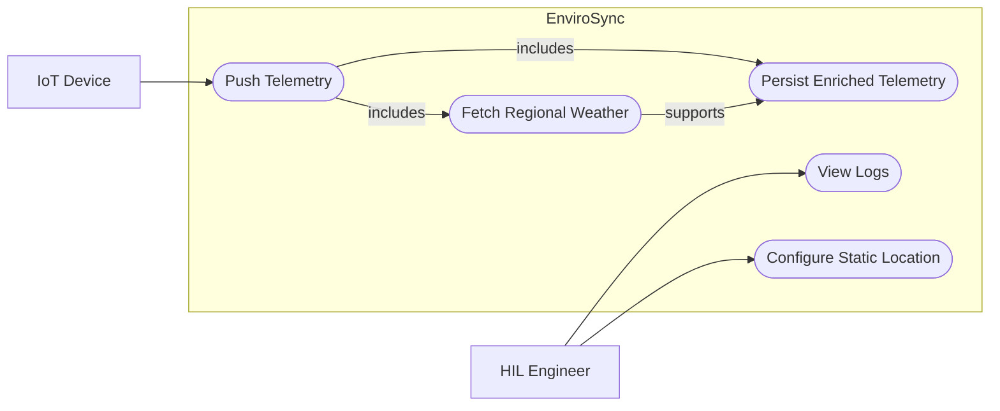
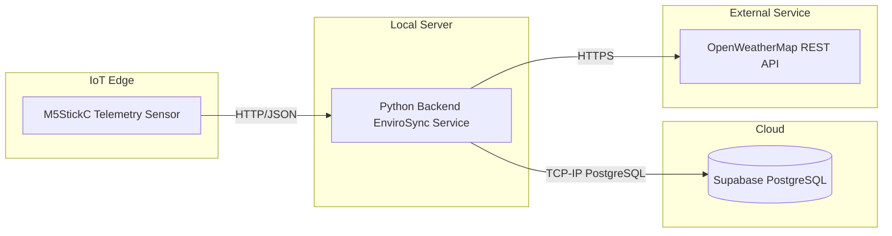

# 

# **SFWRTECH 4SA3: Software Architecture**   **Project Milestone \#2 \- Architecture**  **EnviroSync**

# 1. Project Purpose and Audience

EnviroSync is a backend IoT telemetry system made to collect, organize, and analyze local environmental data. It connects the sensor readings from embedded devices like the M5StickC with regional weather data. The system is mainly for Hardware-in-the-Loop (HIL) engineers and server administrators who need an automatic way to check if local environments like labs or server racks stay in the correct condition compared to outside weather.

# 2. Requirements

| ID | Type | Requirement |
| --- | --- | --- |
| FR-1 | Functional | The backend shall provide an HTTP endpoint that accepts HTTP `POST` requests with JSON telemetry data from the M5StickC device. |
| FR-2 | Functional | The backend shall call the OpenWeatherMap API by using fixed latitude and longitude coordinates to get the current regional weather data for each valid telemetry event. |
| FR-3 | Functional | The backend shall combine the local sensor telemetry with the weather data and store the full record in a PostgreSQL database. |
| NFR-1 | Non-Functional | The system shall use the Circuit Breaker pattern for OpenWeatherMap API calls so repeated external failures can be handled safely without stopping telemetry intake. |
| NFR-2 | Non-Functional | The system shall keep traceability by writing processing events and failure states to console logs and database log records. |

# 3. Scenario Viewpoint

According to the course lectures, the Scenario Viewpoint is used to define the expected behaviour of a system and is usually modeled by using UML Use Case diagrams.

These use cases show the main runtime flow of EnviroSync. The IoT Device starts the process by pushing telemetry data to the backend. After this happens, the backend gets the regional weather data from a fixed location and then stores the combined record for later checking. The HIL Engineer supports the system by setting the static coordinates for the deployment and by checking logs to confirm the system is working normally, to find errors, and to verify degraded mode when the external weather service is not available.

# 4. Physical Viewpoint

According to the course lectures, the Physical Viewpoint focuses on how software is mapped to hardware nodes and is modeled by using a UML Deployment diagram.

The deployment setup puts the M5StickC at the edge, where it reads local environmental data and sends it by HTTP to a Python backend on a local server. The backend is the main integration part. It receives telemetry, calls the OpenWeatherMap REST API by HTTPS to get weather context, and writes the final combined records to a managed Supabase PostgreSQL database over the PostgreSQL protocol on TCP/IP. This design keeps hardware work at the edge, system logic on the local server, and long-term data storage in the cloud.

