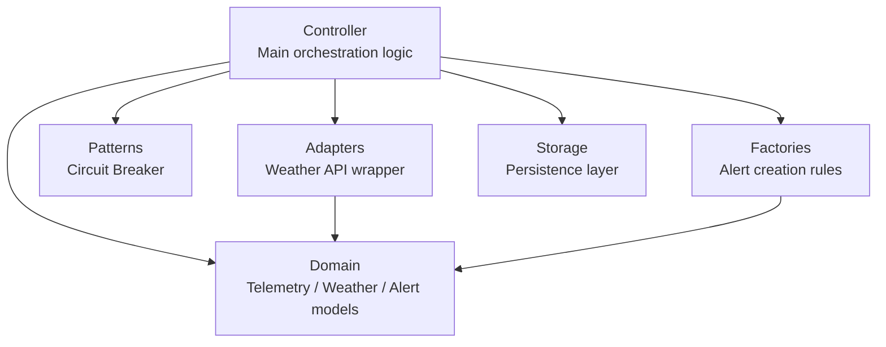
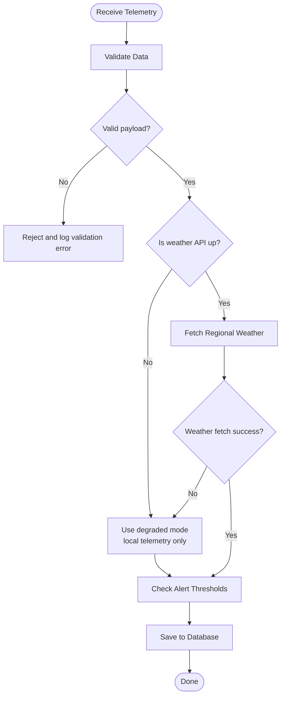
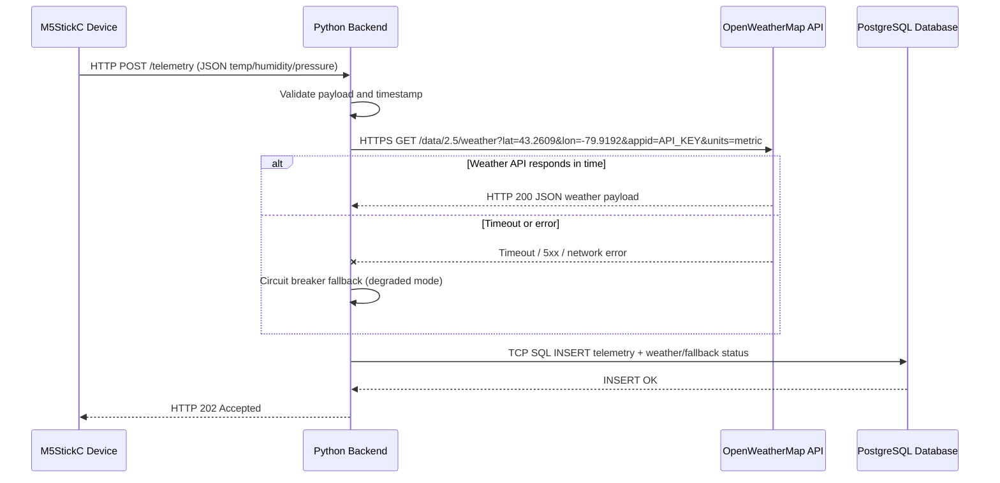

# 

# **SFWRTECH 4SA3: Software Architecture**   **Project Milestone \#3 \- Architecture**  **EnviroSync**

# 5. Development Viewpoint

According to the course lectures, the Development Viewpoint focuses on the software module organization (packages and components).

This diagram shows how I organized the Python modules into clear packages. I split the code this way so each package has one clear responsibility. This makes the project easier to maintain now and easier to extend later when I add more sensors, adapters, or processing rules.

# 6. Logical Viewpoint

According to the course lectures, the Logical Viewpoint focuses on the functionality for the user and support for functional requirements.

This activity flow shows the main functional pipeline of EnviroSync. The backend receives telemetry, validates it, then checks weather API availability before fetching regional weather. After that, it compares values to thresholds and saves the result. If the weather API is down, the system continues in degraded mode and still stores local telemetry.

# 7. Process Viewpoint

According to the course lectures, the Process Viewpoint focuses on runtime behavior and communication between processes during execution.

This sequence diagram shows runtime communication for one telemetry reading. The M5StickC device sends data to the Python backend over HTTP. The backend then calls OpenWeatherMap over HTTPS and writes the combined record to PostgreSQL over TCP. To handle runtime stability, the backend uses request timeout values and can process many readings concurrently with independent request cycles.

