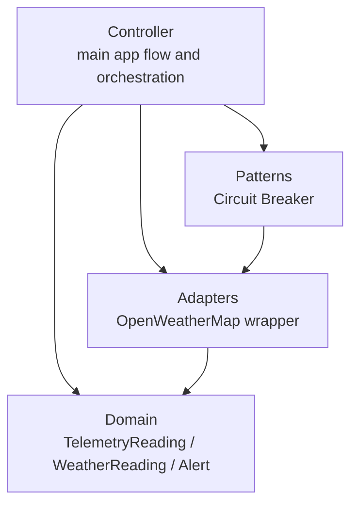
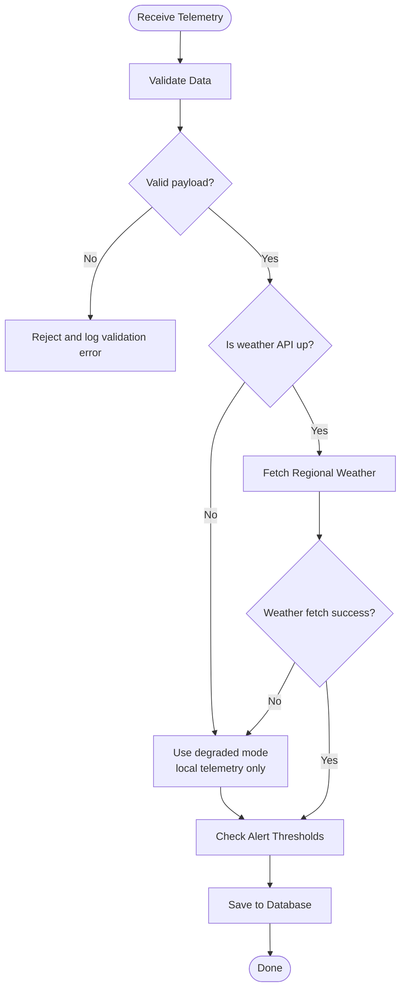
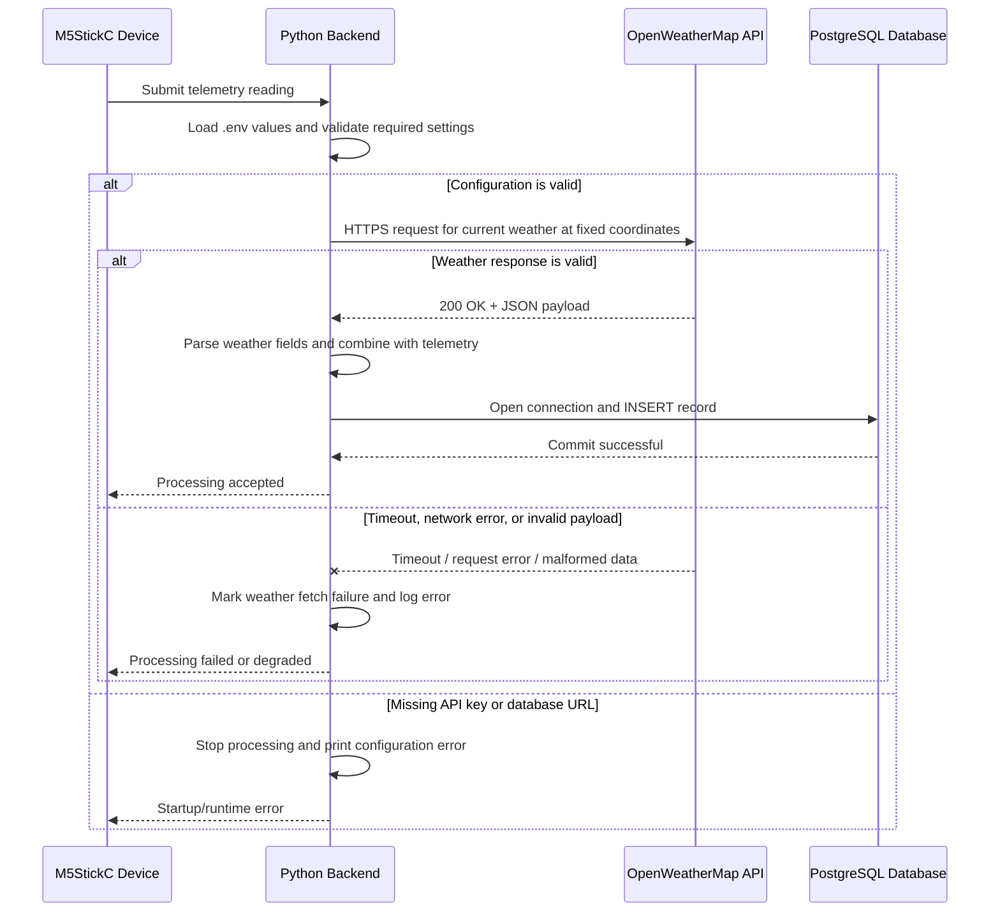

# 

# **SFWRTECH 4SA3: Software Architecture**   **Project Milestone \#3 \- Architecture**  **EnviroSync**

# 5. Development Viewpoint

According to the course lectures, the Development Viewpoint focuses on the software module organization (packages and components).

This diagram shows how I organized the Python modules into clear packages. I split the code this way so each package has one clear responsibility. This makes the project easier to maintain now and easier to extend later when I add more sensors, adapters, or processing rules.

# 6. Logical Viewpoint

According to the course lectures, the Logical Viewpoint focuses on the functionality for the user and support for functional requirements.

This activity flow shows the main functional pipeline of EnviroSync. The backend receives telemetry, validates it, then checks weather API availability before fetching regional weather. After that, it compares values to thresholds and saves the result. If the weather API is down, the system continues in degraded mode and still stores local telemetry.

# 7. Process Viewpoint

According to the course lectures, the Process Viewpoint focuses on runtime behavior and communication between processes during execution.

This process viewpoint describes the runtime execution path that is already visible in this project. The Python service first loads configuration from the environment, then handles one telemetry-processing cycle by calling the OpenWeatherMap API and finally storing the result in PostgreSQL. The main runtime concern is coordination between three active participants: the local backend process, the external weather service, and the database connection. The backend also includes explicit failure branches for missing configuration, API timeout or parsing errors, and database exceptions so the process can fail safely and report the reason.

This sequence is consistent with the current code. In `src/api_test.py`, the process loads `OPENWEATHER_API_KEY`, sends a timed HTTPS request to OpenWeatherMap, checks the HTTP status, and parses the returned JSON before continuing. In `src/db_test.py`, the process loads `DATABASE_URL`, opens a PostgreSQL connection, performs SQL statements, commits successful writes, and rolls back when an exception happens. Together these two runtime paths show the core process behavior of EnviroSync: external service coordination, database persistence, and defensive handling of operational faults.
